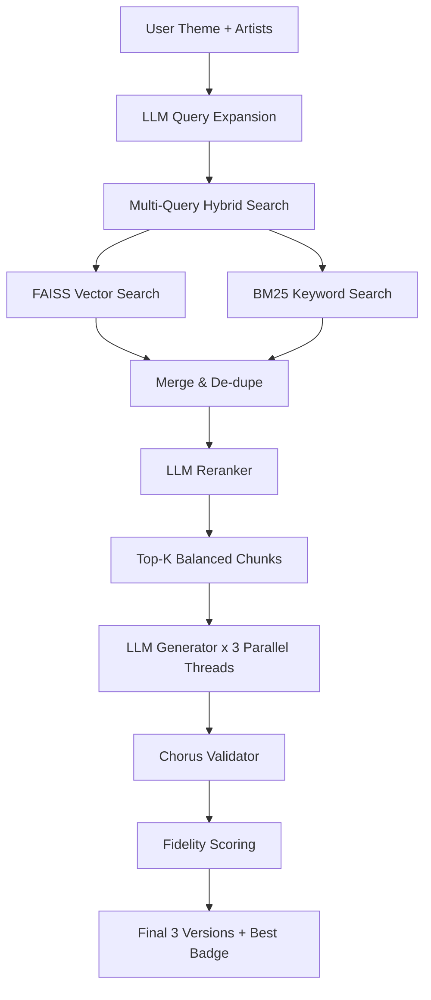

# AI Songwriting System (RAG MVP)

Generate original song lyrics in the style of any artist — or blend multiple artists — using Retrieval-Augmented Generation.

---

## Architecture



| Step | Script | Description |
|------|--------|-------------|
| 1 | `scripts/01_build_dataset.py` | Load Genius dataset, filter artists, clean lyrics |
| 2 | `scripts/02_label_songs.py` | LLM-extract structure + theme for each song |
| 3 | `scripts/03_build_index.py` | Overhauled: Fixed 4-6 line chunks, FAISS + BM25 |
| UI | `frontend/app.py` | High-Performance Streamlit Demo UI |

---

## Quick Start (Demo Mode)

To launch the system instantly:
```bash
streamlit run frontend/app.py
```
*Note: This assumed you have already built the FAISS index locally.*

---

## Running Backend Data Steps

```bash
# Step 1 – Build dataset (~20 min, streams HuggingFace)
python scripts/01_build_dataset.py

# Step 2 – LLM labeling  (~30–60 min, costs ~$5–20 in OpenAI credits)
python scripts/02_label_songs.py

# Step 3 – Build FAISS index  (~10–20 min for embeddings)
#           Embedding cache in data/cache/ means re-runs skip already-embedded chunks
python scripts/03_build_index.py
```

---

## Optional: Billboard Data

Download the Billboard Hot 100 CSV from Kaggle and place it in `data/raw/`:

```
data/raw/charts.csv   (or any file matching *billboard* or *hot*100*)
```

The pipeline will automatically merge chart rankings.

---

## Project Structure

```
.
├── .env                        # API keys (do not commit)
├── main.py                     # Orchestration entry point
├── requirements.txt
├── data/
│   ├── raw/                    # Optional: Billboard CSV
│   ├── processed/
│   │   ├── cleaned_songs.jsonl # After step 1
│   │   ├── labeled_songs.jsonl # After step 2
│   │   └── chunks.jsonl        # After step 3
│   ├── faiss_index/
│   │   ├── lyrics.index        # FAISS binary index
│   │   └── lyrics_meta.jsonl   # Parallel metadata
│   └── cache/
│       └── embeddings.pkl      # Embedding cache (skip re-embed on re-runs)
├── logs/
│   └── generation_logs.jsonl   # Every generation logged here
├── evaluation/
│   └── results.json            # Output of scripts/04_evaluate.py
├── scripts/
│   ├── 01_build_dataset.py
│   ├── 02_label_songs.py
│   ├── 03_build_index.py       # Uses embedding cache
│   └── 04_evaluate.py          # 18-prompt test set + metrics
├── rag/
│   ├── retriever.py            # Metadata-first FAISS search + genre fallback
│   ├── prompt_builder.py       # Structured prompt with output template
│   ├── generator.py            # OpenAI generation (used standalone)
│   └── pipeline.py             # LangChain end-to-end + retry + logging
├── frontend/
│   └── app.py                  # Streamlit UI with history + richer context
└── utils/
    ├── config.py               # Paths, constants, fallback settings
    ├── logger.py               # Generation logger → logs/generation_logs.jsonl
    └── cache.py                # EmbeddingCache (pickle-backed)
```

---

## Demo Features (V5.1)

- **⚡ 1-Click Presets** – Instantly trigger polished demos (Drake, SZA).
- **🏆 Best Version Identification** – Automated fidelity scoring picks the most authentic output.
- **🎯 Smart Hook Extraction** – Prominent visual callout for the song's central hook.
- **✨ Improve Hook Only** – Target specific sections for refinement without trashing context.
- **⚡ Parallel Retrieval** – < 15s end-to-end latency via multi-query threading.
- **⚖️ Artist Balancing** – Zero-bias blending for multi-artist collaborations.
- **✅ Strict Chorus Validation** – Zero-tolerance enforcement of 3-line, rhythmic choruses.

---

## Cost Estimates

| Operation | Approx Cost |
|-----------|-------------|
| LLM labeling (~1500 songs) | $5–20 (one-time) |
| Embeddings (~15 000 chunks) | $1–3 (one-time) |
| Multi-Query & Reranking | ~$0.005 per run |
| 3x Generation | ~$0.03 per run |
| **Total Per Query** | **~$0.035** |

---

## Evaluation

After building the index, run `python scripts/04_evaluate.py` to score the system across 18 test prompts:

| Metric | What it measures | Target |
|--------|-----------------|--------|
| `structure_accuracy` | Fraction of expected section labels in output | ≥ 0.80 |
| `style_similarity` | Jaccard word-overlap with retrieved chunks | ≥ 0.05 |
| `repetition_score` | Line-level chorus/hook consistency | ≥ 0.50 |

Results are saved to `evaluation/results.json`.

## Logging

Every generation (UI or evaluation) is appended to `logs/generation_logs.jsonl` with:
- timestamp, latency
- user inputs (artists, theme, structure)
- retrieved chunk summaries
- full prompt + output
- error (if any)

## Extending the System

- **Add artists**: edit `TARGET_ARTISTS` in `utils/config.py`, re-run steps 1–3
- **Use GPT-4o**: change `GENERATION_MODEL` and `LABELING_MODEL` in `utils/config.py`
- **Swap embeddings**: change `EMBEDDING_MODEL` to any OpenAI embedding model
- **Billboard data**: drop any Billboard CSV into `data/raw/` before step 1
- **Adjust retrieval**: tune `TOP_K`, `FALLBACK_TOP_K`, `MIN_CHUNKS_THRESHOLD` in `utils/config.py`
